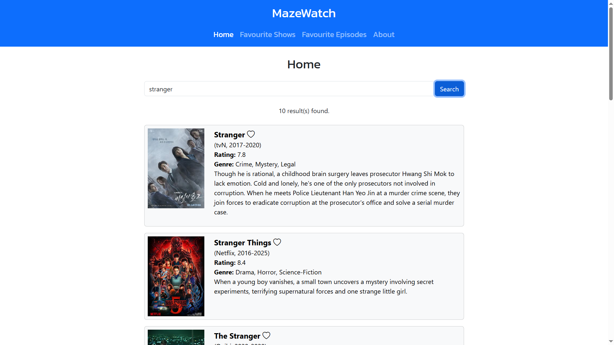
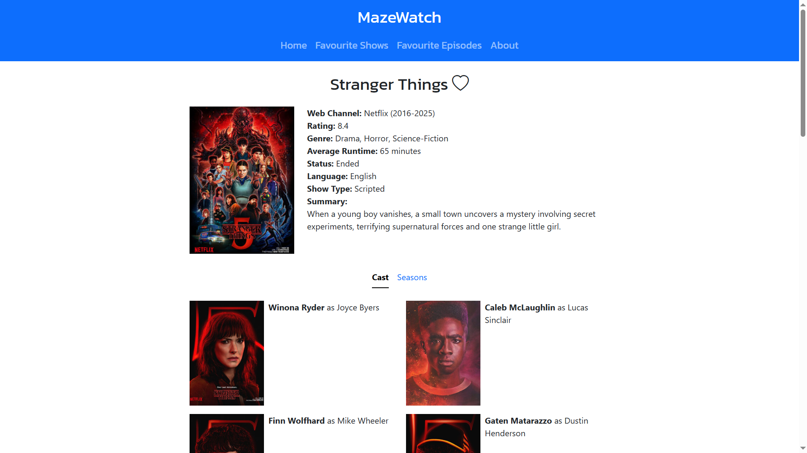
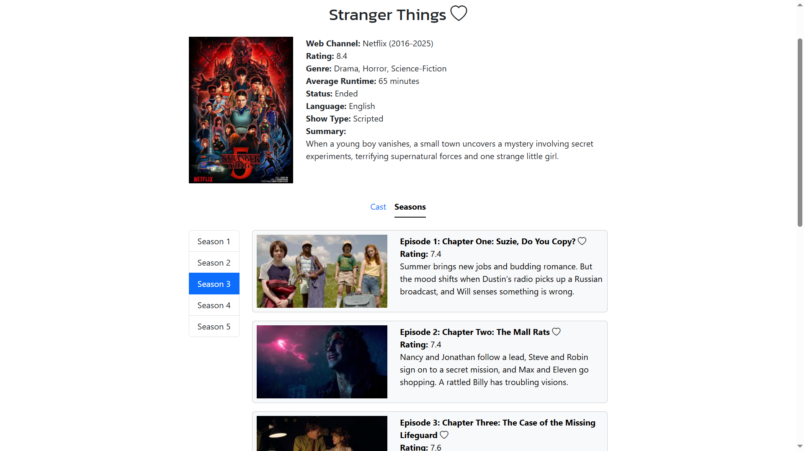
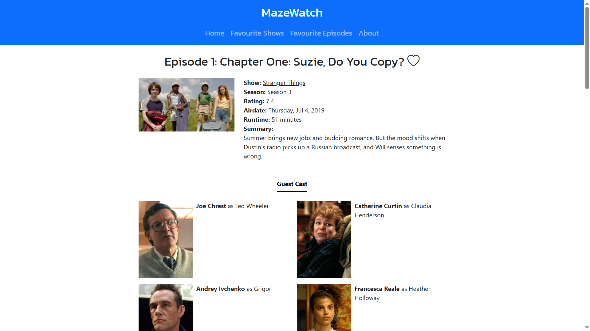
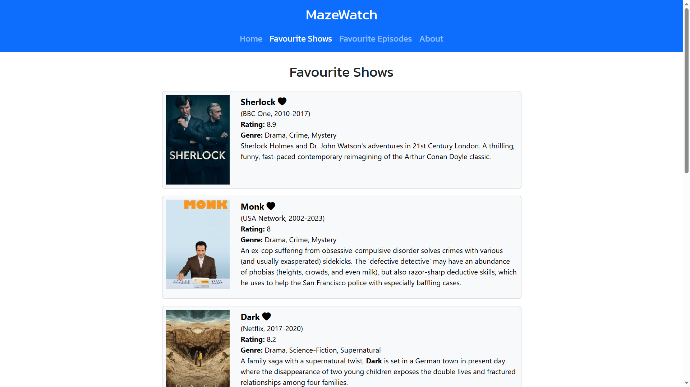
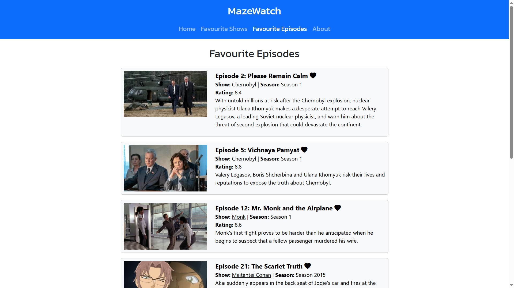

# MazeWatch

MazeWatch is a React-based web application that allows
users to search and track their favorite TV shows and episodes using the
TVMaze API. Users can save their favorite content to custom Favourite
Shows and Favourite Episodes lists, which are saved locally in the
browser using LocalStorage; no account or login required.

### Web App Link

[https://mazewatch.vercel.app/](https://mazewatch.vercel.app/)

### Install project dependencies

```bash
npm install
```

### Run the Development Server

```bash
npm run dev
```

### Screenshots

<p align="center">
  
  
</p>

<p align="center">
  
  
</p>

<p align="center">
  
  
</p>
